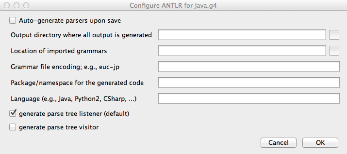

# IntelliJ Idea Plugin for ANTLR v4  [](https://plugins.jetbrains.com/plugin/7358) 

An [IntelliJ](https://www.jetbrains.com/idea/) 2022.3+ plugin for ANTLR v4 ([plugin source at github](https://github.com/antlr/intellij-plugin-v4)).

[Plugin page at JetBrains Marketplace](http://plugins.jetbrains.com/plugin/7358?pr=idea)

This plugin is for ANTLR v4 grammars and includes ANTLR 4.13.2. Works with 
IntelliJ IDEA and other IntelliJ-based IDEs.

## Features:

- syntax highlighting
- syntax error checking
- semantic error checking
- navigation window
- goto-declaration
- find usages
- rename tokens
- rename rules
- save parse trees as svg/jpg/png; right click in parse tree view (1.9)
- comment grammar rule lines with meta-/ (1.7)
- generates Java code; shortcut (ctrl-shift-G / meta-shift-G) but it's in Tools menu and popups.
- code completion for tokens, rule names;
- finds tokenVocab option for code gen if there is a tokenVocab option, don't warn about implicit tokens.
- handles separate parsers and lexers like TParser.g4 and TLexer.g4 (1.7)
- Parse tree nodes show the alternative number the parser chose to match that node. (1.7)
- has live grammar interpreter for grammar preview. Right click on rule and say "Test ANTLR Rule".
- can view parse trees for input matched in more than one way (ambiguities) (1.7)
- can view lookahead trees to show how input directed ANTLR to match a particular alternative (1.7)
- changes to grammar seen in parse tree upon save of grammar.
- refactoring: extra rule, inline rule

You can configure the ANTLR tool options per grammar file; right-click
in a grammar or on a grammar element within the structured view.
When you change and save a grammar, it automatically builds with ANTLR
in the background according to the preferences you have set.  ANTLR
tool errors appear in a console you can opened by clicking on a button
in the bottom tab.

You can use the ctrl-key while moving the mouse and it will show you
token information in the preview editor box via tooltips. Meta-key shows parser call stack.

Errors within the preview editor are now highlighted with tooltips
and underlining just like a regular editor window. The difference
is that this window's grammar is specified in your grammar file.

meta-j pops up a list of live templates, just like it does for Java programming.
Currently, there are a number of lexical rules for common tokens such as comments
and identifiers that you can automatically inject.
There are shortcuts like rid that lets you jump directly to the
lexical rule you would like to generate. If you type the shortcut and wait a
second, intellij should pop up an action you can select for that shortcut.

ctrl-return, or whatever you have configured for the generate pop-up,
will bring up a list of things you can generate. The only one so far is
a generator to create lexical rules for any literals, referenced in the parser
 grammar, that have not been defined.

## Limitations

The `ANTLR Preview` window is based on a grammar interpreter, not on the actual generated parser. 
This means that things like actions and predicates will not be evaluated during live preview,
because the interpreter is language agnostic. 

For the same reasons, if your parser and/or lexer classes extend a custom implementation of the 
base parser/lexer classes, your custom code will *not* be run during live preview. 

## History

See [Releases](https://github.com/antlr/intellij-plugin-v4/releases)

## Screenshots

### Java grammar view


### Find usages


### Code completion


### Live templates

You can inject predefined lexer rules. Use meta-j or type the abbreviation like rid and wait a second. It should pop up that choice.


### Refactoring: generate rules for literals

It guesses rule names or just uses T__&lt;n>. Respects literals already defined. Use Code::Generate menu item or key equivalent.


### Live parse tree preview

You can test any rule in the (parser) grammar.  Right click on rule in grammar
or navigator to "Test ANTLR Rule".  Changing grammar and saving, updates
parse tree. It works with combined grammars and separated but separated
must be in same directory and named XParser.g4 and XLexer.g4.
No raw Java actions are executed obviously during interpretation in
live preview.

[](//www.youtube.com/embed/h60VapD1rOo)


You can also use the ctrl key while moving the mouse in preview window to get token info.


The meta key while moving the mouse shows the parser call stack (path to the root of parse tree).

When there are errors, you will see the output in the small console under the input editor in case you need to cut and paste. But, for general viewing you can however the cursor over an underlined error and it will show you the message in a pop-up. Basically the input window behaves like a regular editor window except that it is subject to the grammar in your other editor.


With alt-mouse movement, you'll see parse region for rule matching token under cursor. Click and it jumps to grammar definition.


### Grammar Profiler

The profiler helps you understand which decisions in your grammar are complicated or expensive.  Profiling data is always available just like the parse tree during grammar interpretation.  The profiler cannot track code execution because it is running the grammar interpreter not executing compiled code.  It provides both a simplified set of columns and an expert set the provides a great deal more information. Clicking on a row in the profiler highlights the decision in the grammar and also highlights relevant pieces of the input, such as ambiguities or the deepest lookahead. You can sort the columns by clicking on the header row. Hover over the header row to get tooltips describing the column.

If you see ambiguities highlighted, those you should definitely take a look
 at in your grammar. If you see decisions requiring full context sensitivity,
 when viewing the expert columns, those are very expensive and could be causing
 speed problems. Note that the profiler always tries to keep up-to-date with
 the input. The profiler uses the parser interpreter but is fairly
 consistent with the speed of a generated and compiled parser but it does use
 single-stage full LL parsing which can be slower.  It needs to do that so
 that it gets full and complete profiling information. For those in the know,
 it uses `PredictionMode.LL_EXACT_AMBIG_DETECTION`. For really big files and
 slow grammars, there is an appreciable delay when displaying the parse tree or profiling information.


### Grammar ambiguities and lookahead

A grammar that matches an input phrase more than one way is considered ambiguous and it's generally an error because we want to interpret input phrases in just one way. ANTLR resolves ambiguities on-the-fly to create a single interpretation (parse tree) but sometimes, for debugging purposes, you'd like to know how else to grammar can match some input. When you have selected an ambiguity using the profiler described in the previous section, you can right click in the preview input window like so:


It will pop up a dialog box that looks like this:


The darkened background node is the node for the rule containing the decision that is ambiguous.  The yellow boxes outlining nodes indicates that it differs from the chosen interpretation of the parse tree. Here's another example that shows two interpretations (of `User f() {`):


Even when a grammar is getting a single interpretation of the input, we often wonder why it's not choosing the path we expected.  When you right click on a lookahead sequence in the input window, it will pop up a dialog to show you how ANTLR tried to use the input to match the alternative. The trees with gray backgrounds indicate the parse trees that were attempted but that failed at some input depth. The tree with a white background chose the chosen parse tree:


### Unicode chars are no problem


### Per file ANTLR configuration



### ANTLR output console


### Color preferences


# Contributing

We [use Gradle](https://github.com/antlr/intellij-plugin-v4/pull/295) to build. To contribute to the project, 
you need a recent version of IntelliJ IDEA (either Community or Ultimate) with the `Gradle` and `Plugin DevKit` 
plugins enabled. 

Use `File > Open` and select the `build.gradle` file to import the project. Once everything is imported, you can run a 
sandboxed IDE using the `runIde` task, either from the `Gradle` tool window of from the CLI:

```
cd ~/antlr/code/intellij-plugin-v4
./gradlew runIde
```

To launch unit tests, run `./gradlew check`.

To build a zipped version of the plugin and its dependencies, run `./gradlew buildPlugin`.

You can tweak the version of the IntelliJ platform used to build/test the plugin in `gradle.properties`, such as:

```
ideaVersion=IC-2020.2.2
```

As of 1.18, java 11 is assumed but you might get away with earlier java.

A high level description of how the plugin works can be found in `ARCHITECTURE.md`.

# Releasing

* Search for 4.9, 4.10 etc... of ANTLR.
* Update release notes in plugin.xml
* Test with multiple IDE versions
* Run unit tests
* Upload to https://plugins.jetbrains.com/plugin/add#intellij
* Write release note in github
